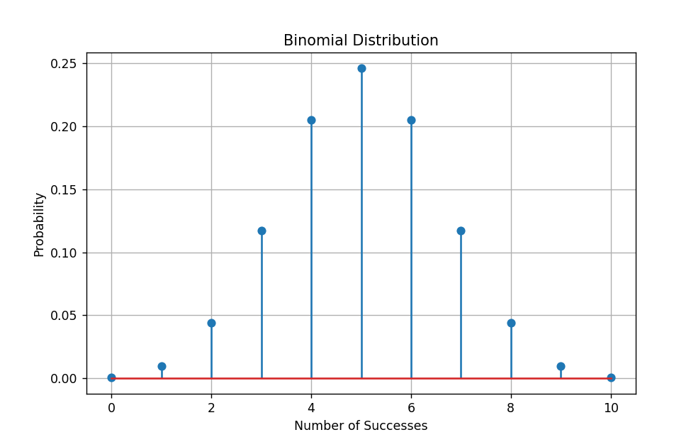
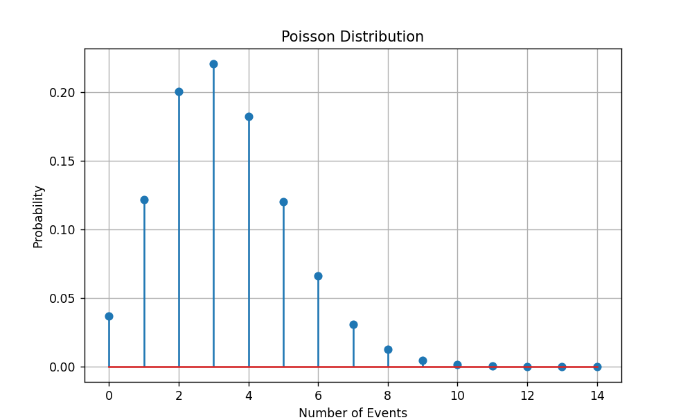

# Probability Distribution using Python

## Project Overview

This project demonstrates two important probability distributions used in statistics and data analytics:

- Binomial Distribution
- Poisson Distribution

Using Python's **SciPy** library, the project calculates the probability mass function (PMF) for both distributions and visualizes the results using **Matplotlib**.

---

## Objectives

- Understand Binomial Distribution.
- Understand Poisson Distribution.
- Calculate probability mass functions (PMF).
- Visualize probability distributions using graphs.
- Learn the practical use of SciPy and Matplotlib.

---

## Technologies Used

- Python 3.x
- SciPy
- Matplotlib
- VS Code

---

## Project Structure

```text
ProbabilityDistribution/
│
├── probability_distribution.py
└── README.md
```

---

## Distributions Covered

### 1. Binomial Distribution

The Binomial Distribution models the probability of obtaining a fixed number of successful outcomes in a fixed number of independent trials.

Parameters used:

- Number of Trials = 10
- Probability of Success = 0.5

Example:

```python
binom.pmf(x, n, p)
```

The project generates a stem plot showing the probability of obtaining 0 to 10 successful outcomes.

---

### 2. Poisson Distribution

The Poisson Distribution models the probability of a given number of events occurring within a fixed interval.

Parameter used:

- Rate (λ) = 3.3

Example:

```python
poisson.pmf(x, λ)
```

The project generates a stem plot showing the probability of observing 0 to 14 events.

---

## Features

- Computes Binomial Probability Mass Function (PMF).
- Computes Poisson Probability Mass Function (PMF).
- Generates probability distribution graphs.
- Uses SciPy for statistical computation.
- Uses Matplotlib for visualization.

---

## Sample Output

```text
===== Binomial Distribution =====
```



```text
===== Poisson Distribution =====
```


```

---
Two graphical windows are displayed showing the Binomial and Poisson distributions.

---

## Installation

Install the required libraries:

```bash
pip install scipy matplotlib
```

---

## How to Run

### Clone the Repository

```bash
git clone https://github.com/<your-username>/probability-distribution-python.git
```

### Navigate to the Project Folder

```bash
cd probability-distribution-python
```

### Run the Program

```bash
python probability_distribution.py
```

or

```bash
py probability_distribution.py
```

---

## Learning Outcomes

After completing this project, you will understand:

- Probability Mass Function (PMF)
- Binomial Distribution
- Poisson Distribution
- Statistical modeling using SciPy
- Data visualization using Matplotlib

---

## Future Enhancements

- Add Normal Distribution.
- Add Uniform Distribution.
- Accept user-defined parameters.
- Save graphs as image files.
- Compare multiple distributions in one program.

---

## Author

**Name:** Deekshitha U  
**Course:** B.Tech – Artificial Intelligence and Data Science  
**Project:** Probability Distribution using Python 
